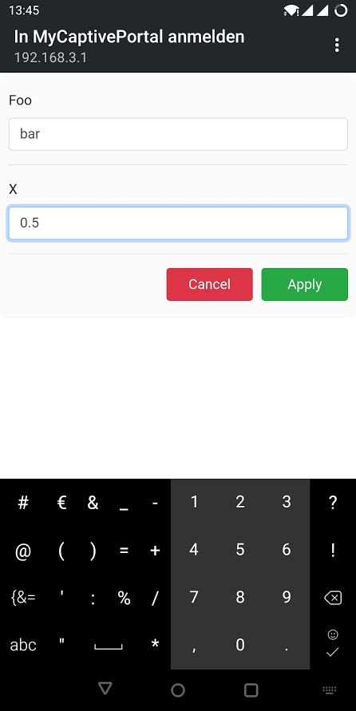

# Esp32FoundationLib
- [Loading and storing of parameters from EEPROM.](#loading-and-storing-of-parameters-from-eeprom)
- [Configure your ESP via serial interface.](#configure-your-esp-via-serial-interface)
- [Create a WiFi-hotspot to configure your ESP32 with your smartphone.](#create-a-wifi-hotspot-to-configure-your-esp32-with-your-smartphone)
- [A WiFi client with auto-reconnect and configurable hostname.](#a-wifi-client-with-auto-reconnect-and-configurable-hostname)
- [A real world WiFi setup example.](#a-real-world-wifi-setup-example)

## Loading and storing of parameters from EEPROM.
```cpp
#include <Arduino.h>
#include <Esp32Foundation.h>

using namespace esp32::foundation;

IntegerParameter startCounter(
    "start_counter", // parameter name
    0,    // default value
    0,    // min value
    1000); // max value

StringParameter foo(
    "foo",  // parameter name
    "bar"); // default value

void printParams()
{
    Serial.println(startCounter.Name + "=" + startCounter);
    Serial.println(foo.Name + "=" + foo);
}

void setup()
{
    Serial.begin(9600);
    
    // print current parameter values
    printParams();
    
    // change some parameters
    foo = "foobar";
    startCounter = startCounter + 1;
    
    // print new parameter values
    printParams();
    
    // save parameters to EEPROM
    DefaultParameterSet.SaveToEEPROM();    
}
```

## Configure your ESP via serial interface.
```cpp
#include <Arduino.h>
#include <Esp32Foundation.h>

using namespace esp32::foundation;

SerialCLI serialCli(Serial);

IntegerParameter sleepDuration(
    "sleep_duration", // parameter name
    1000,  // default value
    10,    // min value
    5000); // max value

StringParameter wifiSsid(
    "wifi_ssid",  // parameter name
    "MyWifi");    // default value

StringParameter wifiKey(
    "wifi_key",   // parameter name
    "topsecret"); // default value

void setup()
{
    Serial.begin(9600);

    serialCli.On("help", [&]() -> bool
    {
        serialCli.PrintCommands();
        return true;
    }, "Prints this help.");

    serialCli.On("restart", [&]() -> bool
    {
        ESP.restart();
        return true;
    }, "Restart the device.");

    serialCli.On("save", [&]() -> bool
    {
        DefaultParameterSet.SaveToEEPROM();
        return true;
    }, "Save configuration to EEPROM.");

    serialCli.On("params", [&]() -> bool
    {
        DefaultParameterSet.PrintParameters(Serial, true);
        return true;
    }, "List parameters.");

    serialCli.On("set", [&](const String& arg0, const String& arg1) -> bool
    {
        auto parameter = DefaultParameterSet.GetParameter(arg0);
        if (parameter != nullptr)
        {
            parameter->SetFromString(arg1);
            return true;
        }
        return false;
    }, "Set parameter.");

    serialCli.On("delete", [&](const String& arg) -> bool
    {
        DefaultParameterSet.Unset(arg);
        return true;
    }, "Delete parameter.");

    delay(3000);
    serialCli.PrintCommands();
}

void loop()
{
    serialCli.Update();
    delay(100);
}
```
```
*************************************************************
USAGE:
  delete     : Delete parameter.
  help       : Prints this help.
  params     : List parameters.
  restart    : Restart the device.
  save       : Save configuration to EEPROM.
  set        : Set parameter.
*************************************************************
Example:
> set wifi_ssid BlaBlub
done
> save
done
```

## Create a WiFi-hotspot to configure your ESP32 with your smartphone.
```cpp
#include <Arduino.h>
#include <Esp32Foundation.h>

using namespace esp32::foundation;

HtmlConfigurator configurator;

FloatParameter x(
    "x", // parameter name
    0.5f,  // default value
    1,     // decimal places
    0.0f,  // min value
    1.0f); // max value

StringParameter foo(
    "foo",  // parameter name
    "bar"); // default value

void setup()
{
    Serial.begin(9600);
    configurator.Start("MyCaptivePortal", "topsecret", "ESP");

    delay (1000);
    Serial.println("WiFi-Hotspot created: 'MyCaptivePortal'");
}

void loop()
{
    configurator.Update();
    if (configurator.IsStopped())
    {
        Serial.println("Configuration done!");
        Serial.println(x.Name + "=" + x);
        Serial.println(foo.Name + "=" + foo);
        delay(5000);
    }

    delay(100);
}
```


## A WiFi client with auto-reconnect and configurable hostname.
```cpp
#include <Arduino.h>
#include <Esp32Foundation.h>

using namespace esp32::foundation;

WiFiSmartClient wifiClient;

StringParameter wifiSsid("wifi_ssid", "MyWifi");
StringParameter wifiKey("wifi_key", "topsecret");
StringParameter hostname("hostname", "MyEsp");

void setup()
{
    Serial.begin(9600);

    wifiClient.Connect(wifiSsid, wifiKey, hostname, 0);
}

void loop()
{
    if (wifiClient.Connected())
    {
        Serial.println("online");
    }
    else
    {
        Serial.println("offline");
    }
    delay(1000);
}
```

## A real world WiFi setup example.
On startup it tries to connect to wifi for five seconds. If this fails, it starts the configuration server.
```cpp
#include <Arduino.h>
#include <Esp32Foundation.h>

using namespace esp32::foundation;

HtmlConfigurator configurator;
WiFiSmartClient wifiClient;

StringParameter wifiSsid("wifi_ssid", "MyWifi");
StringParameter wifiKey("wifi_key", "");
StringParameter hostname("hostname", "MyEsp");

void setup()
{
    Serial.begin(9600);

    // try for 5 seconds to connect
    if(!wifiClient.Connect(wifiSsid, wifiKey, hostname, 5000))
    {
        Serial.println("Can't connect to WiFi!");

        // stop auto-reconnect
        wifiClient.Disconnect();

        // register callbacks
        configurator.OnCancel([&]()
        {
            Serial.println("Configuration aborted!");
            configurator.Stop();
        });
        configurator.OnApply([&](ParameterSet& params)
        {
            Serial.println("Configuration completed!");
            params.SaveToEEPROM();
            configurator.Stop();

            ESP.restart();
        });

        // start wifi-hotspot
        if (configurator.Start("EspSetup", "test1234", hostname))
        {
            Serial.println("WiFi-Hotspot created");
        }
    }
}

void loop()
{
    configurator.Update();

    // add your code here ...

    delay(1000);
}
```
